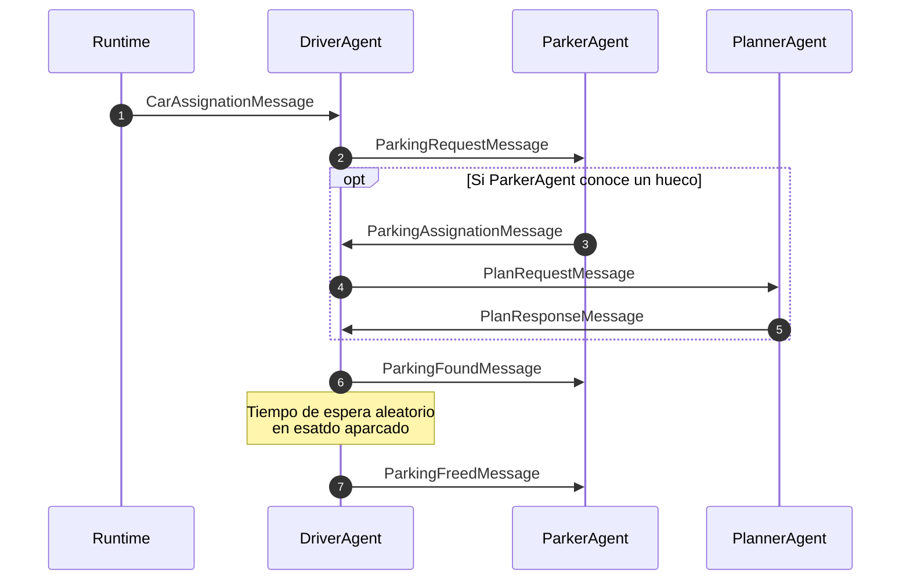
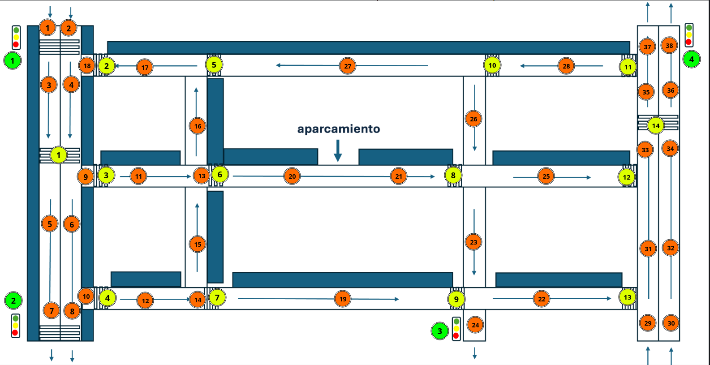

# Práctica final de Sistemas Multiagente

## Estructura del proyecto

El proyecto se ha implementado como un módulo Python llamado `sma`, compuesto por los siguientes submódulos:

- `sma.environment`: Define las clases necesarias para la simulación del entorno de tráfico, siendo `circuit.py` la más
  importante por controlar la carga de datos y la coordinación de todos los elementos.
- `sma.agent`: Contiene las implementaciones de agentes y mensajes.
- `sma.graphics`: Implementa una clase que recibe el histórico de la simulación para renderizarlo.

## Ejecutar la simulación

Las dependencias se encuentran en el fichero `requirementes.txt`. Se recomienda su instalación en un entorno virtual:

```python
python -m venv venv
source venv/bin/activate
pip install -r requirements
```
Instrucciones del programa:
```shell
usage: python -m sma [-h] [--output OUTPUT] [--input INPUT] map

positional arguments:
  map              Map file

options:
  -h, --help       show this help message and exit
  --output OUTPUT  Output file
  --input INPUT    Input file

```

El proyecto incluye un fichero `soho_map.json` que debe pasarse **siempre** como argumento, para la correcta carga de la
información del entorno. Si no se especifica nada más, la simulación se ejecutará por defecto según los parámetros de
`sma/config.py` y escribirá el histórico en un fichero `output.json` (parametrizable mediante la opción `--output`)
antes de mostrar un renderizado de la simulación.

```shell
python -m sma soho_map.json
```

Puesto que la simulación tiene un alto coste computacional y puede durar varios minutos, se ha implementado la opción
`--input` para pasarle al programa un `json` de salida generado por alguna simulación anterior, de manera que el propio
`output.json` generado por defecto puede pasarse al programa para volver a visualizar la simulación sin necesidad de
ejecutarla de nuevo, como sigue:

```shell
python -m sma soho_map.json --input output.json
```

## Agentes y mensajes

El sistema multi-agente de este proyecto considera tres tipos de agentes:

- `DriverAgent` o *conductor*. Se implementa como una máquina de estados cuyo objetivo es conducir un coche y llevarlo a
  un aparcamiento o a una salida. Para ayudares en la toma de decisiones, se comunica con los agentes *aparcador* y
  *planificador*.
- `ParkerAgent` o *aparcador*. Lleva un registro interno de los agentes que quieren aparcar y de posiciones de
  aparcamientos libres. El registro comienza vacío, así que su conocimiento de los aparcamientos disponibles depende de
  la información que recibe de los agentes *conductores*.
- `PlannerAgent` o *planificador*. Ofrece un servicio de planificación de rutas, ponderando el coste de cada calle según
  su longitud y también su grado de ocupación por otros coches.

A continuación se muestra el diagrama de secuencia correspondiente al proceso de aparcado y los mensajes asociados.



- En caso de que el aparcador no conozca un hueco disponible, el conductor tomará desvíos aleatorios en busca de un parking, hasta encontrar alguno y notificarlo.

- En caso de que otro coche ocupe el parking que había asignado para el conductor antes de que éste llegue a él, las comunicaciones se reinician desde el paso 3 (cuando el aparcador reconoce algún hueco nuevo).

## Consideraciones sobre la simulación

### Modelo de las calles
La simulación se ha implementado utilizando un modelo de grafo que conecta los segmentos de calles disponibles. A continuación hay un mapa de estos segmentos:



En naranja, los identificadores de los segmentos de cada calle, en amarillo los identificadores de los pasos de peatones y en verde los de los semáforos. Nótese que cuando un semáforo coincide con un paso de peatones, sólo se modela el semáforo (no se han contemplado peatones imprudentes).

De la misma forma, tampoco se ha contemplado la conducción temeraria ni coches de diferente longitud o con distintas velocidades.

### Código de color

En el histórico de la simulación se almacena un color asociado al estado de cada conductor:

|Color|Estado|
|---|---|
Amarillo | Buscando aparcamiento
Blanco | Aparcado
Rojo | Buscando una salida específica del circuito

### Sobre el ancho de las calles

El modelo del grafo contempla las calles como unidmiensionales. Esto provoca ciertos desajustes visuales en los cruces.

### Mejoras pendientes

No se ha implementado el edificio del aparcamiento, sólo los de las calles.

Además, se observan problemas en lo referente a el solapamiento de coches (hay algunos coches que ignoran la colisión y otros que no) y al bloqueo de rutas. Esto último es lo que más entorpece la simulación, puesto que dos coches que quieran pasar de una paralela a otra al mismo tiempo se detectan como un bloqueo mutuo y se detienen, quedando la calle cortada.